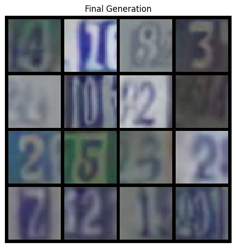
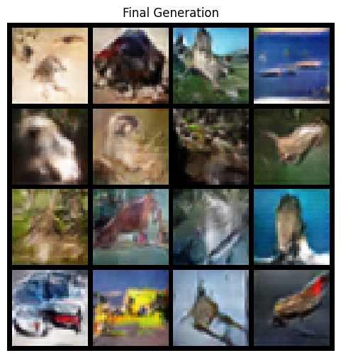

# DCGAN Implementation — Assignment 3

Reproducing the paper **"Unsupervised Representation Learning with Deep Convolutional Generative Adversarial Networks"** (Radford et al., 2016) from scratch.

Course: Machine Learning for Remote Sensing II — Spring 2025  
**Siddharth Verma | 22B2153**

---

## What this repo contains

```
├── DCGAN_Comparison.ipynb   # Main notebook — training, evaluation, results
├── DCGAN_SVHN.png           # Generated SVHN samples (epoch 20)
├── DCGAN_CIFAR10.png        # Generated CIFAR-10 samples (epoch 20)
└── report.pdf               # Assignment report
```

---

## The paper

Radford, A., Metz, L., & Chintala, S. (2016). *Unsupervised Representation Learning with Deep Convolutional Generative Adversarial Networks.* arXiv:1511.06434v2.

The key idea: train a GAN with specific architectural constraints (strided convolutions, BatchNorm, no FC layers) to make training stable, then use the discriminator's learned features for downstream classification tasks.

---

## What I implemented

- `Generator` — takes a 100-dim noise vector, produces 32×32 RGB images via transposed convolutions
- `Discriminator` — classifies real vs fake using strided convolutions, outputs a scalar logit
- `train_dcgan` — adversarial training loop with `BCEWithLogitsLoss`
- `extract_and_evaluate_svm` — extracts discriminator features and trains a Linear L2-SVM on top

All architecture choices match the paper: strided convolutions, BatchNorm (skipped on G output and D input), ReLU in G / LeakyReLU(0.2) in D, Tanh at G output, weights from N(0, 0.02).

---

## Results

Trained on SVHN and CIFAR-10 for 20 epochs each. Features from the discriminator are evaluated with a Linear L2-SVM on 1,000 labelled examples (matching the paper's protocol).

**SVHN**

| Model | Test Error |
|---|---|
| KNN | 77.93% |
| M1 + M2 | 36.02% |
| SWWAE (dropout) | 23.56% |
| DCGAN + L2-SVM (paper) | 22.48% |
| **DCGAN + L2-SVM (ours)** | **25.13%** |
| Supervised CNN (same arch) | 28.87% |

Our model beats all non-GAN baselines and the supervised CNN, coming within 2.65 pp of the paper.

**CIFAR-10**

| Model | Accuracy |
|---|---|
| DCGAN + L2-SVM (paper) | 82.8% |
| **DCGAN + L2-SVM (ours)** | **54.02%** |

The gap here is large because the paper pre-trains on Imagenet-1k (1.2M images) and transfers those features — we train directly on CIFAR-10.

---

## Generated samples

| SVHN | CIFAR-10 |
|---|---|
|  |  |

---

## Setup

```bash
pip install torch torchvision scikit-learn matplotlib tqdm
```

Then just run the notebook top to bottom. Datasets (SVHN, CIFAR-10) download automatically.

Runs on CPU but a GPU is recommended — each 20-epoch run takes ~1–2 hours on CPU, ~15–20 mins on a T4.

---

## Config

```python
config = {
    'latent_dim': 100,
    'im_size': 32,
    'batch_size': 128,
    'lr': 0.0002,
    'num_epochs': 20,   # increase for better results
}
```

Adam optimizer with lr=0.0002 and β₁=0.5, matching the paper.

---

## Limitations

- 20 epochs isn't enough — the generator loss is still rising at the end, especially on CIFAR-10
- No Imagenet pre-training, which is the main reason for the CIFAR-10 gap
- Feature vector is 7,168-dim vs 28,672-dim in the paper (smaller model)
- No FID/IS metrics computed

---

## Reference

```
@article{radford2016dcgan,
  title={Unsupervised Representation Learning with Deep Convolutional Generative Adversarial Networks},
  author={Radford, Alec and Metz, Luke and Chintala, Soumith},
  journal={arXiv preprint arXiv:1511.06434},
  year={2016}
}
```
